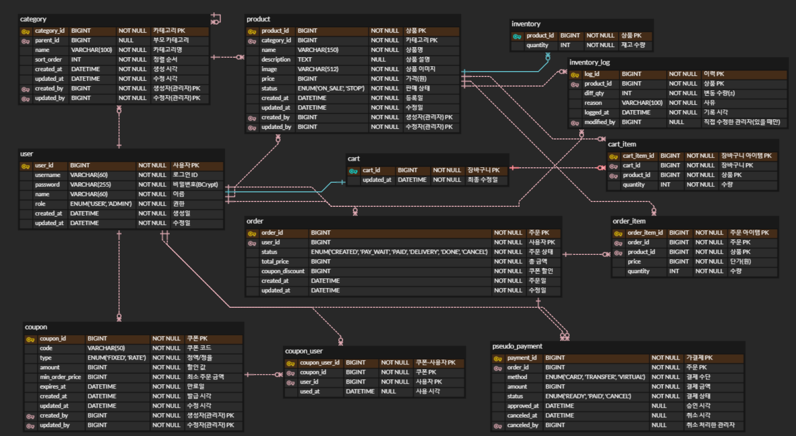

# 🛍️ KHMall

## 📝 프로젝트 설명
KHMall은 **상품 관리, 주문 처리, 재고·회원 관리를 지원하는 통합 백엔드 시스템**입니다.
- **회원**은 회원가입·로그인, 장바구니 담기, 주문 조회 등을 할 수 있고
- **관리자**는 상품 등록·수정·삭제, 주문·재고 관리 등을 할 수 있습니다.

---

## ⚙️ 주요 기능
### 1. 회원
- 회원가입 / 로그인
- 사용자 권한: 일반 회원 vs 관리자
- (로그인 세션 유지·만료는 토큰 기반으로 처리)

### 2. 카테고리
- 최대 5단계 상·하위 카테고리 생성 / 수정 / 삭제
- 카테고리별 상품 목록 조회

### 3. 상품
- 상품 등록·수정·삭제 (관리자)
- 상품 목록 / 상세 조회 (회원)
- 재고와 연동되어 판매 상태 자동 반영

### 4. 장바구니
- 상품 담기, 수량 변경, 삭제
- 장바구니 전체 조회

### 5. 주문
- 장바구니 기반 주문 생성
- 주문 상태 흐름: **주문 생성 → 결제 대기 → (결제 완료 → 배송 준비) → 배송 중 → 배송 완료**
- 주문 내역 조회 및 결제 전 취소 요청

### 6. 검색
- 키워드(상품명·카테고리) 기반 검색
- 인기 검색어 TOP 10 제공

### 7. 쿠폰·할인
- 관리자 쿠폰 발급 (정액 / 정율)
- 주문 시 쿠폰 적용 (주문당 1매, 중복 불가)
- 쿠폰 사용·만료 이력 관리

### 8. 결제 (가결제)
- 내부 **가결제 테이블**로 승인·취소 관리
- **PG 연동 시 ERD 수정·컬럼 확장 예정**

### 9. 웹훅 (예정)
- 주문 상태·재고 품절 알림용 Webhook 설계
- **현재 ERD 미포함, 추후 구조 확정 후 테이블 추가**
---
## 🗂️ ERD

---
## 🛠️ 기술 스택

| 영역 | 사용 기술                                                   | 용도 |
|------|---------------------------------------------------------|------|
| **Language** | **Java 21**                                             | 백엔드 핵심 언어 |
| **Framework** | Spring Boot 3.5.4 Spring Data JPA Spring Security | REST API, ORM, 인증·권한 |
| **Database** | MySQL 8                                                 | 영속 데이터 저장 |
| **Cache / Message** | Redis 7                                                 | 세션·장바구니 캐시, Pub/Sub |
| **Search** | Elasticsearch 8                                         | 상품 검색·필터링 |
| **Build** | Gradle 8                                                | 의존성 관리·빌드 |
| **Testing** | JUnit 5                                                 | 단위·통합 테스트 |
| **Code Utils** | Lombok                                                  | 보일러플레이트 제거 |
| **API Docs** | SpringDoc OpenAPI 3 + Swagger-UI                        | 실시간 API 문서 |

---
## ❓ Troubleshooting

| 증상 | 원인 | 해결 방법 |
|------|------|----------|
| | |